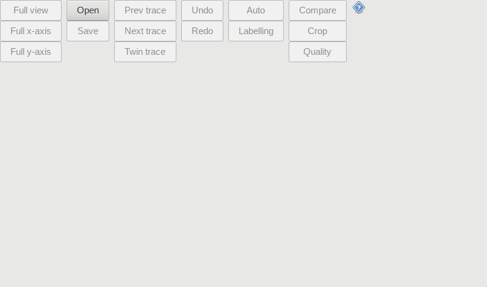
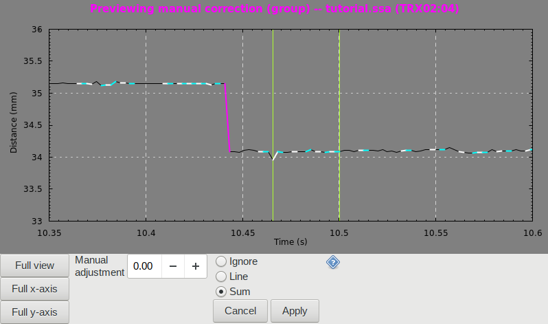

# User's guide

This user's guide is written as an extension of a **paper** (not yet published)
that introduces sonomicrometry, the correction of artifacts in sonomicrometry,
and the aims and approach of this program. We will sometimes make reference to
concepts introduced in that paper.

---

## Tutorial

This tutorial explains how to use the interface of the program, that is, which
buttons and mouse gestures one should use to access the program's functionality.

We will walk through the process of artifact correction using this program by
correcting two example distance traces.

Tip: If you happen to do something by accident and open an unfamiliar page or
menu, look for and press a button labelled 'Back' or 'Cancel' to return the
program to its home page.

Tip: If you make unintentional changes to the data, you can use the 'Undo'
button to reverse the changes. And if you accidentally 'Undo' something, use the
'Redo' button.

Note: A "screenshot" function was added to the program after this tutorial was
written. It is safe to ignore it for this tutorial.

### 1. Structure of the interface

The graphical user interface of this program is comprised of a single window
divided into two parts. The upper part displays the distance traces (the
_display_) while the lower part contains the buttons used to control the program
and manipulate the distance traces (the _controller_).

### 2. Starting up the program

- **Start the program by launching the SonoCleaner executable.**

Upon startup, the program opens the controller to its 'home page'.

The display is not yet opened; it appears only when we have opened a
Sonometrics .ssa file.

### 3. Opening an .ssa file

- **Click the 'Open' button** (found in second column of buttons).
  
This will open a file browser with which you can select a Sonometrics .ssa
file.

The file containing the examples traces is found in the 'examples' folder, which
should be in the same directory as this document. The file is called
'tutorial.ssa'.

- **Use the file browser to browse to the 'examples' folder. Select
  'tutorial.ssa', and click the 'Open' button at the bottom right corner.**

Upon opening an .ssa file, the display appears, showing the first trace
of the file.

For those who might be interested, the .ssa file used in this tutorial is a
recording of distances within a muscle (the rabbit medial gastrocnemius). The
muscle starts at a reference length, is stretched to a target length, is made to
contract for about 800 ms, and is then brought back to the reference length.

The title of the display shows the file name
(tutorial.ssa)
and the label of the currently selected distance trace
(TRX02:03).

The distance trace appears as a thin black line. The level-shifts in the trace
are automatically highlighted in alternating magenta and yellow.

The horizontal axis represents time (in seconds);
the vertical axis represents distance (in millimeters).

### 4. Inspecting traces: controlling the display

Before attempting to correct artifacts in a distance trace, one should inspect
the distance trace for abnormalities. For this, we will need to control the
display.

Left-clicking with the mouse at a point on the display will center the
display at that point. This action can be used for panning (that is, to move
around in the trace).

Scrolling the scroll wheel of the mouse on the display will zoom the display.
Zooming acts with respect to the point at which the display is centered.

Use just the scroll wheel on its own to zoom in or out. Hold the Control key
while scrolling to zoom in or out _horizontally_ (that is, in the time axis);
hold the Shift key while scrolling to zoom in or out _vertically_ (that is, in
the distance axis).

Now let's inspect the first cluster of level-shifts.

- **Left click on the first cluster of level-shifts at (12.5 s, 17.5 mm)** (that
  is, at about a time of 12.5 s and a distance of 17.5 mm) in order to center
  the display over them.  
- Then, to zoom in, **scroll with the mouse wheel while holding the Control
  key until one can observe four separate level-shifts.** You may need to
  re-center the display as you zoom in.

One can use the buttons in the first column, 'Full view', 'Full x-axis', and
'Full y-axis', to quickly zoom out.

- **Zoom out, then zoom in to the other level-shifts to inspect them as well.**

The level-shifts in this trace are typical and well-behaved. There are no
abnormalities.

### 5. Applying automatic elimination of level-shifts

The first step in correcting artifacts is usually the application of the
automated procedure.

- **Set the view so that it is zoomed in as much as possible while keeping all
  of the level-shifts in view.**  
- Then, **click the 'Auto' button** (found in the second last column of
  buttons).

Clicking the 'Auto' button switches the controller to a new page for
automatically eliminating level-shifts.

The display now shows a _preview_ of the changes that would be made to
the trace by the automatic procedure.

Now we will advance the automatic procedure one step at a time.

- **Increase the 'Match level' by clicking the plus button once and observe the
  changes to the trace.**

Some level-shifts are eliminated. Modified segments of the trace are highlighted
in alternating white and cyan.

Level-shifts are eliminated in groups, and in increasing order of the length of
time they span: the automated procedure will eliminate groups of level-shifts
that span shorter time intervals before those that are spread over longer time
intervals.

The automated procedure is not intended to handle all cases gracefully. So then,
we need to examine each step in order to check for errors and intervene if
necessary.

- **Increase the 'Match level' repeatedly, observing the changes at each step,
  until the match level cannot be increased further.**

Disappointingly, the action of the automatic procedure is acceptable for this
trace, and we do not need to intervene.

- Since we are satisfied with the matches, **click the 'Apply' button**.

Clicking the 'Apply' button returns the controller to the home page and
applies the previewed changes to the data.

Had we not been satisfied, clicking 'Cancel' would have also returned the
controller to the home page, but would not have applied any changes to
the data.

Tip: Apart from one exception covered later (the "interpolation brush"), the
program only makes changes to the data when a button labelled 'Apply' is
pressed. Furthermore, changes made to the data will not be applied to the
original .ssa file, unless of course you tell the program to save your changes
by overwriting the original file (more on saving later).

We have now completed the correction of this trace.

### 6. Checking the corrected trace for consistency

It is important to check one's corrections for consistency with other data, such
as data from replicates of the same procedure.

In sonomicrometry, we can check for internal consistency by comparing the two
'twin' traces obtained from each pair of crystals. Since each distance
measurement involves a pair of crystals, a transmitting crystal and a receiving
crystal, swapping the roles in a crystal pair yields another measurement of the
same physical distance (the 'twin' trace).

Since the current trace is TRX02:03, its twin is TRX03:02.

Note that a distance trace and its twin are not necessarily identical, despite
measuring the same physical distance. One reason for this is that the
sensitivities of each crystal for detecting ultrasound pulses are set
independently, and so may differ.

Let's now compare our trace to its twin.

- **Click the 'Compare' button** (found in the last column of buttons).

This switches the controller to a new page for superimposing other traces
over the current trace.

- **Turn on the 'Show replicate traces' option.**

This superimposes two traces on the display: (1) the aforementioned 'twin'
trace, in blue, and (2) the current trace but without any of our modifications,
in grey. (One can superimpose other traces as well, which we will do shortly.)

The twin trace is clean and without artifacts.

Since our corrected trace and its twin follow each other reasonably well, apart
from an unavoidable distance offset, we consider them to be consistent and are
satisfied with our corrections.

In this example, we are using an artifact-free twin trace to demonstrate the
validity of our corrections. In practice, however, given an artifact-free trace,
we would not even consider correcting its twin, since we may simply throw away
the twin and use the higher quality trace instead.

The only situation where it makes sense to compare twin traces is when both twin
traces have artifacts or are otherwise questionable in quality. In those cases,
one may wish to attempt the correction of both twin traces before comparing them
in order to properly "blind" oneself.

- To blind ourselves for the next trace, **turn _off_ the 'Show replicate
  traces' option.**

While we are here, let me introduce another feature. Over the current trace, one
may superimpose, not just the twin trace, but any other trace within the file.
This is done by setting the 'Reference trace'.

- **Set the 'Reference trace' to the last trace, labelled 'NON'.**

In this example file, the 'NON' trace contains a sync pulse that shows when
stimulation was applied to the muscle. This trace is superimposed over the
current trace in green. Unlike the superposition of replicate traces, the
distances of the reference trace are scaled to fit within the same view as the
current trace.

- **Set the 'Reference trace' back to 'None'.**  
- Then, **click the 'Back' button** to return to the original controller page.

### 7. Selecting traces

The distance trace we just corrected (TRX02:03) was extremely simple. Let's move
on to a slightly more difficult trace.

One may use the 'Next trace' and 'Prev trace' buttons (in the third column of
buttons) to select other traces from the file.

- **Click the 'Next trace' button once** to select the 'TRX02:04' trace.

### 8. Correcting a non-trivial trace

- As before, **inspect the trace for abnormalities**.

This is a poor quality trace. In many places the data is noisy, and there are
indeed a number of abnormalities. For example, at about 3.5 s and 16.2 s we see
the distance trace shift momentarily to a lower "level" while showing signs of
instability and variation.

The distance trace also jumps to a lower level at about 12.55 s for just a
handful of data points, but this data looks more like a "nonsensical artifact"
rather than a level-shift artifact: it is not nearly as smooth as the data
around it, nor does it look like a continuation of the surrounding data
(when ignoring the distance offset).

### 9. Stopping the automated procedure when it makes errors

Having inspected the trace, we begin correction, as usual, by applying the
automated procedure.  

- If you haven't done so already, **zoom in vertically to more clearly see the
  trace.**
- Then, **apply the automated procedure step-by-step, noting steps which make
  questionable corrections**.

We find the changes made between steps 15, 16, and 17 to be questionable. Why?
In each case, the automatic procedure ignores a group of level-shifts spanning a
very short time interval and instead matches a group spanning a much longer
interval.

The change from step 15 to 16 matches a distant level-shift with one of the two
level-shifts of the nonsensical artifact that we previously identified. To
remedy this situation we will want to eliminate this nonsensical artifact.

The transition from step 16 to 17 matches a level-shift at 10.50 s to a distant
one to the right, at 12.52 s, rather than the nearby one to its left, at 10.47
s. The reason for this is that the level-shift at 10.47 s is a bit too large to
pair with the one at 10.50 s, having been lengthened by random noise. Our
approach will be to manually pair these two level-shifts.

But first, let's apply the automated procedure as far as we think it makes no
questionable corrections.

- **Set the 'Match level' of the automated procedure to 15, then click
  'Apply'.**

### 10. Manual corrections of groups of level-shifts

Let's first handle the erroneous transition between steps 15 and 16.

- **Zoom to the nonsensical artifact at (12.55 s, 33 mm).**

We will now apply a manual correction to a group of two level-shifts (we might
call them merely discontinuities rather than level-shifts since we think they
arise from a nonsensical artifact), which are located at about 12.54 s and 12.57
s.

To select a group of level-shifts, select a time interval by clicking and
dragging horizontally with the right mouse button on the display.

- **With the right mouse button, click and drag horizontally on the display from
  a time of 12.54 s to 12.57 s** to select the two level-shifts. (You must click
  and drag within the area of the plot, and not on the axes of the plot.)
  
If the selected time interval contains at least two level-shifts, the controller
will switch to a new page for handling groups of level-shifts.

If you selected the wrong group, or if you selected only a single level-shift,
press the 'Cancel' button to try again. It may help to zoom in a bit further, if
you haven't already.

The display now shows a _preview_ of the selected changes. The selected group of
level-shifts is flanked by two vertical green lines.

There are two parameters available for correcting a group of level-shifts.

The first parameter is the type of correction, which can be either 'Line' or
'Sum'. Here we will use the 'Line' correction.

- **Change the correction type from' Ignore' to 'Line'.**

The 'Line' option interpolates linearly over the span of the group of
level-shifts. This option is only suitable for eliminating nonsensical artifacts
that begin and end on the same "level".

The second parameter is a manual adjustment which applies a distance offset to
the section of the trace spanned by the group of level-shifts. This option
should be used sparingly, and only to make minor adjustments. Furthermore, it
cannot be used with the 'Line' option.

- **Click the 'Apply' button** to apply the change to the group of level-shifts.

Now let's handle the second erroneous transition.

- **Zoom to the other problematic region at (10.48 s, 34.5 mm).**

Here, there are 3 level-shifts in close proximity.

- **Click and drag horizontally with the right mouse button from 10.46 s to
  10.51 s** to select the two right-most level-shifts of the three.  
- Then, **apply the 'Sum' correction with no 'Manual adjustment'** (that is,
  with the default Manual adjustment of 0.00).

The 'Sum' correction sets the height of each level-shift in the group to zero,
except for the first, which it sets to the _sum_ of the heights of the group of
level-shifts. This has the effect of redistributing and combining all of the
heights of the level-shifts into the first level-shift.

### 11. Proceeding with the automated procedure after making manual corrections

Having removed the artifacts we observed to be causing problems, we will proceed
again with the automated procedure.

- **Apply the automated procedure to completion**.

This time, the automated procedure makes no apparent errors.

### 12. Manual corrections of individual level-shifts

After the previous application of the automated procedure, there still remains
one level-shift. Remaining level-shifts are unavoidable for this trace, since it
starts and ends on different "levels". Without another level-shift with which to
form a group, the only course of action is to correct this level-shift as an
individual.

To select an individual level-shift, right-click on it. (Actually,
right-clicking anywhere on the display will select the nearest level-shift.)

- **Right click on the remaining level-shift.**

Upon selecting a level-shift, the controller will switch to a new page for
handling individual level-shifts. The display now shows a _preview_ of the
changes that would be made to the level-shift. The selected level-shift is
flanked by two vertical green lines (probably too close to each other to be
distinguished at low zoom), and its height in millimeters is shown to its right
in green text.

There are three parameters available for correcting an individual level-shift.

The first parameter is the type of correction, which can be either 'Zero' or
'Slope fit'.

The 'Zero' option sets the height of the level-shift to zero, while the 'Slope
fit' option sets the height to an estimate of the slope of the surrounding data.

There is usually only a small between the two types of correction, except when
the level-shift occurs during a quick movement (in which case 'Slope fit' is
preferred), or if the data is noisy (in which case 'Zero' is preferred). If the
level-shift occurs during quick movement and the data is also noisy, the proper
correction may be ambiguous, in which case correction is not advised.

Since there is little difference between 'Zero' and 'Slope fit' for this
level-shift, we will use the 'Zero' correction as a no-assumptions default.

- **Change the correction type from' Ignore' to 'Zero'.**

The second parameter, the 'Manual adjustment', applies an additional offset to
the height of the level-shift. This option should be used sparingly, and only to
make minor adjustments.

The third parameter is the 'Hold'. It is necessary to apply a distance offset to
at least one half of the trace in order to change the height of a level-shift.
For simplicity, we hold one side constant; one can choose this side by setting
the 'Hold' to either 'Left' (the default) or 'Right'.

One can more clearly observe the effect of the 'Hold' option by switching back
and forth between the 'Ignore' and 'Zero' options while the hold is set to
either Left or Right.

Ultimately, the choice of 'Hold' does not matter because, in our opinion, traces
obtained by sonomicrometry should only be used to infer _changes_ in distance,
and not absolute distances. However, it may be desirable to control the height
of traces, for example, in order to more closely align a trace with its twin for
closer comparison, or if one is sure that a portion of the trace tracks the
very first ridge of the ultrasound pulse.

We will not use a 'Manual adjustment', and will keep the 'Hold' set to 'Left'.

- **Click the 'Apply' button** to apply the change to the individual
  level-shift.

### 13. Checking the non-trivial trace for consistency.

Let's again compare our correction to the twin trace.

- **Click on the 'Compare' button, turn on the 'Replicate traces' option, and
  click the 'Back' button.**

To see things more clearly, let's view things from the twin trace.

- **Click on the 'Twin trace' button** (found in the third column of buttons),
  to switch to the TRX04:02 trace.

Our corrected trace now appears in blue behind the twin trace, which now appears
in black.

Ignoring the artifacts of the twin trace (which can be quickly corrected), it
appears that our corrected trace tends to follow its twin trace somewhat
closely, except that it has noticeably more noise and variation.

One source of variation in the distance trace is related to the fact that it
often flickered between two levels. In such cases, the lower level is often more
variable than the upper level, and is the case for this trace in particular.
Since the automated procedure unfortunately chose to make corrections favouring
this lower level, the resulting trace inherits its variability.

### 14. Manual corrections with the interpolation brush

This program has another method of manual correction to address the kind of
variation we observe in our corrected trace. To apply this new method, let's
first undo our previous corrections.

- **Click the 'Twin trace' button** to switch back to the TRX02:04 trace.  

One can undo (and redo) the changes one makes by clicking the 'Undo' (and
'Redo') button.

- **Repeatedly click the 'Undo' button** to undo all of our changes and revert
  the distance trace to its original state.  
  
The program keeps a history of all previous states of the trace, where each
trace has its own history. The 'Undo' button is used to visit previous states,
while the 'Redo' button is used to return to more recent, "future" states. Note
that making a new change to the trace will cause the program to forget any
"future" states.

- **Zoom to the section of the trace at around 3.5 s.**

This section of the trace appears flicker between two levels, but predominantly
"tracks" the lower level. The data on the lower level is noisy and variable, so
we would prefer to reconstruct the trace by using the upper level as a template.

To achieve this, we will draw for the program a boundary between the upper and
lower levels. This is done by clicking and dragging with the right mouse button
while holding down one of the Shift or Control keys. This gesture provides the
program with a line connecting two points: (1) the location at which the right
mouse button was pressed, and (2) the location at which the right mouse button
was released. Holding down the Control key tells the program we want to keep the
upper level and replace the lower, while holding the Shift key does the
opposite.

- **Move the mouse cursor to (3.3 s, 34.0 mm).**  
- **Press and hold the right mouse button.**  
- **While holding down the right mouse button, move the mouse cursor to (3.8 s,
  34.0 mm).**  
- **Press and hold down the Control key.**
- **Release the right mouse button.**  
- **Release the Control key.**

The first of the next screenshots shows, in green, the line the instructions
intend for you to draw with the mouse. The second screenshot shows the intended
result.

If your results do not match the second screenshot, one can always click the
'Undo' button to try again.

All the data points below the line are "rejected" and replaced by linear
interpolation between data points above the line. The same end could more
painstakingly be achieved by repeated use of the 'Line' correction for groups of
level-shifts, but the process is streamlined with the use of this manual
correction, which we call the "interpolation brush".

We can apply the interpolation brush to most of the other artifacts of this
trace (it is not necessary for the tutorial to follow the remaining steps in
this section).

The rest of the correction is completed by application the automated procedure,
followed by the individual correction of a remaining level-shift.

An aside for those who may be feeling that the use of the interpolation brush
just demonstrated is too arbitrary and ad-hoc: we are of the opinion that the
interpolation brush should only be used in situations where rigorous use of the
other methods suffices to correct the trace (see the "Example protocol and
restrictions on manual corrections" section, below). Used only in this way, the
interpolation brush does not affect whether or not a distance trace can be
corrected, but only serves to reduce the variance of an already corrected trace.
By this reasoning, our liberal use of the interpolation brush on this trace is
justified by our previous correction of this trace.

### 15. Quality annotations

At this point, we have cleaned two traces, TRX02:03 and TRX02:04, to completion.
However, the more difficult of the two, TRX02:04, was clearly of lower quality.
Perhaps we might like to make note of this, for example, in order to inform
subsequent analyses that we have less confidence in the more difficult trace.
This program has rudimentary support for making such notes.

- **Click the 'Quality' button** (found in the last column of buttons).

The controller switches to a new page for annotating the current trace
with one of three labels: 'Good', 'Moderate', and "Bad'. These labels have no
meaning to the program and do not affect the data processing in any way;
the user may use these labels in whatever way they wish.

By default, all traces begin with a label of 'Good'.

- **Click the 'Moderate' button** to give the trace the label of 'Moderate'.

The controller immediately switches back to the home page. The background
of the display becomes tinted with blue to reflect the new label.
(Likewise, the 'Bad' label is associated with a red tint, and 'Good' with the
default grey.)

One could easily record more detailed annotations on one's own; the main point
of this feature is convenience. When saving an .ssa file, the annotations are
automatically saved alongside the .ssa file in a separate comma-separated-value
(CSV) file. Upon loading the saved .ssa file, the program will also load the CSV
file of annotations and apply them to the traces. Furthermore, having the
annotations automatically saved in a CSV file spares one the trouble of writing
out the annotations by hand in a format suitable for input into other programs.

### 16. Cropping

There are cases where one would like to focus on only a part of a distance
trace. Perhaps one would like certain conditions to hold at the start and end of
a trace (for example, to make things easier for subsequent analyses), or perhaps
one is correcting a very long recording that would be best dealt with
piece-by-piece. These cases can be handled with the cropping feature.

- **Click the 'Crop' button** (found in the last column of buttons).

The controller switches to a new page for cropping traces.

Click and drag horizontally on the display with the right mouse button to
select a time interval to which the trace should be cropped.

- **With the right mouse button, click and drag from a time of about 10 s to 15
  s.**

Note that in order to include the very beginning or end of the trace in the
selected time interval, one may need to zoom out horizontally.

Two green vertical lines appear, showing the bounds of the selection,
and the 'Crop to selection' button becomes enabled.

- **Click the 'Crop to selection' button.**

The portions of the trace not in the selection are no longer visible.
The controller immediately switches back to the home page.

One can apply cropping multiple times.

- **Zoom in, then crop again to a time interval from about 12 s to 14 s.**

The trace is now further cropped.

Cropping simultaneously affects all of the traces in the file.

- **Switch the display to the 'TRX02:03' trace** to see that it too has been
  cropped.

The way in which the program applies cropping is to merely restrict the view of
the data to the selected time interval. Cropping has no effect on data
processing, except that you can't make new changes to data outside of the
current bounds. And since no data is thrown away during cropping, one can also
undo a crop.

Then, this means that we can crop a trace, then undo changes that were made
before the crop, even if some of those changes lie outside the cropping bounds.

- **Press the 'Undo' button while viewing the 'TRX02:03' trace.**

- **Click the 'Crop' button** to bring up the cropping page.
- Then, **click the 'Uncrop' button.**

The missing portions of the trace from 10 s to 15 s now reappear in their
original form.

Tip: One may restrict the action of the automated procedure to a chosen time
interval by cropping the trace.

### 17. Saving an .ssa file

We will, of course, want to save the changes and annotations we have made.

- **Click the 'Save' button** (found in the second column of buttons).

This opens a file browser with which one can choose a directory and name for a
new .ssa file. The current state of all the traces will be saved into this file.

By default, the program selects for the new .ssa file the same directory and
file name as the original .ssa file, but prepends "output\_" to the file name.

- **Click the 'Save' button in the file browser** to use the default location
  and file name.

For this tutorial, if the program complains in a pop-up notification that the
default save file exists already, just overwrite it by clicking the 'Replace'
button.

Upon a successful save, the program confirms the output file name, and
summarizes the numbers of 'TRX channels' annotated with each possible label.

Note, however, that the program reports only two 'TRX channels' when our file
contains five traces. There are two things going on.  

1. The summary only considers traces with labels of the form 'TRX\_\_:\_\_'.
   This is meant to include only traces that are distance traces, and not, for
   example, the 'NON' trace that contained the sync pulse.
2. The summary groups together a distance trace and its twin into one channel.
   The rationale is that if a distance trace and its twin have different
   qualities, we would use only the one with the better quality and throw away
   the other. Therefore, we only report the better of the two quality
   annotations.

The motivation for summarizing trace qualities in this way is for the
3D-reconstruction of crystal coordinates from sonomicrometry data, where it can
be useful to know the number of channels of each quality.

Now, let's open the .ssa file we just saved to examine just what was recorded.  

- _A note of caution: Opening another .ssa file will discard all the changes made
  to the current file. If you want to keep your changes, make sure to save them
  before switching to another file._
- **Click the 'Open' button and open output\_tutorial.ssa**, the file we just
  saved.

The first thing to notice is that the cropping has been preserved. The data
outside the cropping bounds was not recorded in the saved file.

- **Switch the display to the 'TRX02:04' trace.**

Notice that the background of the 'TRX02:04' trace is tinted blue, meaning that
the 'Moderate' quality annotation we assigned to it was preserved.

Checking the directory of the saved .ssa file will reveal a file named
'output\_tutorial.ssa.quality', which contains the quality annotations. This
is the CSV file that is searched for and opened alongside the .ssa file.

Most importantly, the modifications we made to the trace have also been
preserved, but there is a lack of the white and cyan highlights. This is because
the record of which segments of the trace have been modified is not recorded in
the new file.

**There is another limitation:** the time of the saved trace now starts at 0 s,
even though the cropping bounds started at around 10 s. This is just a
limitation of the program where it always displays times starting from 0;
examining the saved .ssa file will reveal that the proper timestamps have been
saved. (See "Evenly spaced data points" in Limitations section).

### 18. Labelling parameters

In our correction of these example traces, we took for granted that the
level-shifts would be automatically labelled. We implicitly made use of the
default parameters for labelling level-shifts. These parameters can be adjusted
to suit crystals of different sizes or to handle more difficult, lower quality
traces.

- **Click the 'Labelling' button** (found in the second last column of buttons).

The controller switches to a page for adjusting the parameters for
labelling level-shifts.

The first parameter, the 'Level-shift threshold', informs the program of the
minimum height of a level-shift in the data. The proper value for this
parameter may be obtained by examining the trace.

The second parameter, the 'Noise threshold', informs the program of the maximum
change in distance between two adjacent distance measurements that is due purely
to random noise. The proper value for this parameter can be estimated by
examining the noise in the data, but may possibly need some experimentation.

The default value for the 'Level-shift threshold' (0.72 mm) was chosen for
sonomicrometry data obtained using Sonometrics' 1 mm and 2 mm crystals. From
these crystals, we expect sizes level-shifts of about at least 0.75 mm (see the
"Typical sizes of level-shifts" section in the paper). Adding a small margin
yields the default value.

The default value for the 'Noise threshold' (0.10 mm) was chosen for a low noise
level, since the procedures used by the program are unsuited for noisy data.

The default parameters can be obtained by clicking the 'Reset parameters'
button.

Changing the labelling parameters immediately updates the labelling of
level-shifts in the display.

Be aware that the 'Noise threshold' is also used by the automatic procedure as
the tolerance for forming "zero-sum groups of level-shifts" (see the paper).

### 19. Additional reference

This tutorial has introduced all but one of the functions available in this
program. This function is the "screenshot" function, which was added after this
tutorial was written and will not be covered.

For reference, each page of the controller has a help icon located
towards its upper right. Hovering the mouse over that icon will pop up a help
text. Furthermore, many buttons also have mouse-over help texts with reminders
or additional explanation.

---

## Tips and recommendations

1.  Most buttons have an associated keyboard shortcut that can be found in its
    popup. The keyboard shortcut is listed in square brackets.

1.  Right-clicking the plus and minus beside an input field for a number will
    select the maximum and minimum values. For example, one can select the
    maximum 'Step' value for the automated procedure to quickly assess the
    limits of the automatic correction. Also, middle-clicking the plus and minus
    buttons will increment or decrement the number with a larger step size.

1.  The program's window can be enlarged just as with any regular window.
    However, it cannot be made smaller.

1.  A lightened or greyed-out button indicates its function is temporarily
    blocked because the tool knows that pressing this button will produce no
    effect in the current context.

1.  Due to limitations of this program, left-clicking at a point near the center
    of the display may make no visible change to the view, but be assured that
    the point at which the display is centered has been updated.

---

## Limitations of the program

### Supported operating systems

Currently only MacOS and 64-bit Linux (x86\_64) operating systems are supported.

On MacOS, the use of a two-button mouse is highly recommended.

### Interoperability with SonoSoft

This tool can currently only read and write .ssa files. Because SonoSoft cannot,
to our knowledge, read .ssa files, the outputs of this tool cannot be imported
back into any SonoSoft tools (such as SonoXYZ).

Furthermore, this tool should only be given raw, unmanipulated distance traces.
This is because the 'Manipulate > Remove outliers' function in SonoSoft, for
example, performs smoothing that can interfere with this program's procedures
for detecting and correcting level-shifts.

### Supported versions of .ssa files

The Sonometrics' .ssa file format has several incompatible versions. This tool
has only been tested on versions 3.00 and 3.10 of the .ssa file format, and may
fail to open other versions of .ssa files. The format of a .ssa file can be
found on its second line (when opened as a text file).

The version of an .ssa file created by SonoSoft depends on the version of
SonoSoft. You could try to use a newer version of SonoSoft to export .ssa files
of a supported version. If this program does not support a certain .ssa version,
please contact us and send us an example .ssa file so that we may add support
for it.

The reading of .ssa files is probably the most unreliable part of the program.

### Minimum sampling rate

This program has a soft requirement on the minimum sampling rate used to obtain
the distance traces. A higher sampling rate helps to estimate slopes and to
differentiate level-shifts from regular movements. So far, this tool has mostly
been tested on traces recording sudden contractions of rabbit muscles, for which
sampling rates of at least 400 Hz were sufficient.

### Evenly spaced data points

This program completely ignores the values under the 'Time' column of the .ssa
file, and assumes that all data points are uniformly separated by the 'Sample
time interval' (found on line 6 of the .ssa file). This makes the programming
simpler.

The first data point is always displayed at time of 0 seconds.

Since the 'Sample time interval' is not exact, there will be a discrepancy
between the times in the plots of the program's display and the times
found in the .ssa file. This discrepancy grows proportionally with the length of
the trace.

### Length of traces

The amount of computational work required to process and display a distance data
is proportional to its length. When working with increasingly long traces, it
will take an increasingly long time for the operations to complete, reducing the
interactivity of the program. Operations may begin to have noticeable delay on
traces with more than 50,000 data points (100 seconds at 500 Hz) when all
possible traces are superimposed, depending of course on the speed of one's
computer.

The slow speed is due, in part, to the program's use of the CPU for rendering
the display. Therefore, using a computer with more powerful GPU may not speed up
the program.

One workaround is to use the 'Crop' feature of this tool to focus on one portion
of the trace at a time.

---

## More on sonomicrometry

The paper briefly described level-shifts and other sonomicrometry artifacts in
Section 2.2. Assuming that the reader is familiar with that section, we expand
upon that section here. We will also continue to "pretend" that the triggering
protocol of the sonomicrometer is a simple threshold.

But first, we repeat the disclaimer given at the beginning of that section.

> Note that the following details may apply only to the sonomicrometers
> manufactured by Sonometrics, as data acquired with these devices were used to
> develop the artifact removal program. Moreover, we stress that the following
> is merely our own explanation of sonomicrometry artifacts based on empirical
> observations using the sonomicrometer's built-in support for viewing raw
> ultrasound signals with an oscilloscope.

### More on dropout artifacts

"Dropout" artifacts were introduced in Section 2.2.3 of the paper under Caveat
3. Briefly, they are discontinuity artifacts distinct from level-shifts in that
the data associated with these artifacts is completely unrelated to the actual
distance between the crystals.

Dropout artifacts may arise from electrical interference, whereby the detection
threshold may be triggered prematurely, eclipsing the true distances for a
period of time. Alternatively, the received ultrasound pulses may become so
attenuated that the threshold does not trigger, in which case the sonomicrometer
reports an impossibly large default distance. Or, the threshold may trigger on a
later ridge, one that is not one of the first several; deceptively, the
positions of these ridges are unstable and do not reliably reflect "true"
changes in distance, yet change smoothly and continuously. From these examples,
one can imagine that the sizes of discontinuities associated with dropout
artifacts are much larger and more varied than those associated with
level-shifts, which is indeed the case.

### Other sonomicrometry artifacts

It is important to note that level-shifts and other artifacts may also be
generated by other mechanisms. We will not focus on these mechanisms for the
reason that we are unable to address the complexity of the artifacts that they
can generate. For example, larger changes in the relative orientation of
crystals may also cause level-shifts due to the fact that the some
sonomicrometry transducers, moreso those that use disc-shaped piezoelectric
crystals, "transmit" and "receive" ultrasound pulses in a direction dependent
manner. The effects of crystal reorientations on the ultrasound signal include a
vertical flipping (when viewed on an oscilloscope). This "signal flip" will, in
particular, flip the sign of the ridge on which the threshold triggers so that
the ridge will then lie below the horizontal axis, where it can no longer meet
the threshold. The threshold must then necessarily trigger on something else,
causing a level-shift. However, during this flipping, the ultrasound signal can
change in a complex manner, generating complex discontinuities that both the
software tool and the authors cannot address. Therefore, we urge the reader to
keep in mind that this software tool and user's guide can only address the
aspects of sonomicrometry we discuss, which are not comprehensive.

### Typical sizes of level-shifts

We can estimate the sizes of level-shifts _on average_ by modelling the
ultrasound pulse by a pure sinusoid. However, a glance at the raw ultrasound
signal on an oscilloscope will show that it is often not a sinusoid, in
particular because its ridges may have unequal spacing and unequal widths; so,
indeed, our estimates can only be valid on average.

Let us first examine the typical size of a level-shift that jumps between two
adjacent ridges of an ultrasound pulse. We can make a first approximation of the
size of a level-shift by assuming that it is equal to the length of the
oscillation period of the ultrasound pulse. If the ultrasound pulse is a
sinusoid, then its oscillation period is equal to the ratio of its propagation
speed to its frequency. For example, for a frequency of 1.2 MHz
(emitted by Sonometrics' 2 mm crystals; 1.6 MHz for their 1 mm crystals
(Sonometrics manual)), and a propagation speed of 1592 m/s (for muscle at 37
degrees Celsius (Marsh, 2016)), the resulting estimate of the level-shift size
is about 1.3 mm.

However, this is only an upper bound to the size of a level-shift: the
level-shift may not span an entire oscillation period. Indeed, the detection
threshold may trigger closer to the peak of an earlier ridge, but on the
rising-edge of a later ridge. In the extreme case, the shortest possible
level-shift must extend at least from the very peak of one ridge to the rising
zero-intercept of the next; on a pure sinusoid, such a level-shift would span
3/4 of the oscillation period. By this reasoning, the difference in size between
the smallest and largest level-shifts should be no greater than 1/4 of the size
of the largest. Continuing with our example, we would then expect level-shifts
to be about at least 1 mm and at most 1.3 mm in size.

Alternatively, shorter level-shifts may also result from "signal flips" that
reflect the ultrasound pulse vertically (see the end of section 2.2.3). The
action of a vertical reflection on a sinusoidal ultrasound pulse is to cause a
phase-shift by half the oscillation period; if this reflection is also sudden,
it results in a level-shift of the same distance. Then, the smallest
level-shifts may be about as small as half the size of the largest, if we take
into account the possibility of signal flips.

Now, what about larger level-shifts that jump, not to an adjacent ridge, but over
multiple oscillation periods at once? For this, we will need to know just how
many oscillation periods a level-shift can span. The number of oscillation
periods is finite since the intensity of a typical ultrasound pulse quickly
plateaus as it reaches full strength; because the earlier ridges eclipse the
later ridges, there are only a limited number of ridges on which the detection
threshold can trigger. With this principle in mind, empirical observations of
raw ultrasound signals suggest that level-shifts (in reasonable data) span at
most two, but sometimes three, oscillation periods. Continuing with our example,
we should then expect that level-shifts are mostly no larger than 2.6 mm, and
only sometimes as large as 3.9 mm. Therefore, discontinuities larger than 4 mm
are likely to originate from dropout artifacts rather than level-shifts.
Extending this reasoning, reasonable data with a _total_ level-shift offset of
more than 4 mm from the lowest "level" should be atypical as well, which is
consistent with our experience.

### On absolute versus relative distances in sonomicrometry

It is our opinion that the distance traces obtained from sonomicrometry, on
their own, are insufficient to capture the _absolute_ distances between the
crystals, but only capture the _changes_ in those distances; knowledge of the
absolute distances can only be obtained by the incorporation of information
external to the distance traces, such as an external measure of distance at a
known point in the trace, which is not within the scope of this software tool.

One way to obtain some knowledge of absolute distances is to use an oscilloscope
to verify, at some point in a distance trace, that the sonomicrometer triggers
on the rising edge of first ridge of a strong, well-defined ultrasound pulse.
This would allow one to rule out the contribution of sonomicrometry artifacts to
the distance measurement at that point.

---

## Examples of bad data

The goal of cleaning sonomicrometry distance traces is to (1) obtain smooth,
continuous distance traces, but while (2) detecting and rejecting bad data.
However, this program leaves to the user's judgment the task of detecting and
rejecting bad data.

To assist with this goal, we provide some examples of bad data.

### example1.ssa -- Avoid data with large level-shifts

In an above section, we claimed that distance trace obtained by tracking ridges
far beyond the first few could result in smooth, continuous traces that are
completely unrelated to the 'true' distances. The TRX01:02 trace in example1.ssa
is an extreme example of this, having _huge_ level-shifts, where portions of the
distance trace must track a very late ridge.

"Correct" this trace by applying the automated procedure to completion, then
collapsing the remaining level-shifts with the 'Hold' set to 'Right'.

Then, turn on the 'Show replicate traces' option to superimpose the artifact-free
twin trace, and observe the discrepancy.

---

## Example protocol and restrictions on manual artifact correction

The inclusion of manual corrections of artifacts in the correction procedure
creates opportunity for bias. In an attempt to control this bias, we restrict
applications of manual corrections to one of 5 cases. The rule of thumb is to
never introduce non-zero-sum displacements until it is necessary in the final
stages of correction. If the trace cannot be corrected with combined
applications of these 5 manual corrections together with the automatic
procedure, we reject the trace. Furthermore, the corrected trace should be
checked for consistency against the uncorrected trace and the other trace using
the same crystal pair (e.g. "TRX01:02" and "TRX02:01").

(Case 1) _To remove gaps in the data produced by the nonsensical artifacts._
Artifacts generating data that are not strictly displacements of the "true" data
(Caveat 3) are not accounted for by the automated procedure and therefore must
be removed. We require that the data after the gap returns to the same "level"
it occupied before the gap, that is, that no level-shift occurred during the
gap. To signify that we are not willing to guess what the data should have been,
we merely interpolate linearly over the gaps when removing them.

It can be easy to identify gaps when there are drastic changes in the quality of
the trace or large discontinuities, but distinguishing gaps from level-shifts in
general is treacherous. For reasons discussed in Section 2.2.4, we reject data
flanked by discontinuities larger than 4 mm.

(Case 2) _To remove single point outliers or other small artifacts that trip up
the automatic level-shift labelling procedure._ Sometimes there are small,
isolated fluctuations with sizes just peeking over the thresholds of the
level-shift detection heuristic. For example, oftentimes only one of the two
slopes of a single point outlier is labelled, which induces a displacement in
the trace upon its "correction". Similarly to the treatment of gaps in the data
(Case 1), these abnormalities are flattened out by interpolating linearly over
them.

(Case 3) _To select a preferred "level" when the trace flickers between two_.
Sometimes the tracking of the ultrasound pulse will rapidly switch back and
forth between two adjacent ridges. This appears in the distance trace as many
level-shifts between two parallel "levels", as shown below in (A). Oftentimes,
one "level" is more reliable than the other. For example, in (A), the lower
level is more noisy than the upper level; if corrections are made such that data
in the upper level are displaced to fit into the lower level, the result is a
noisy trace (B). Instead, we can try to preserve the better data in the upper
level by using it as a template with which we manually interpolate over the
poorer data in the lower level (C).

(A)

(B)

(C)

(Case 4) _To force the redistribution of a group of level-shifts that nearly but
not quite forms a zero-sum group given the specified tolerance._ Sometimes a
group of level-shifts spans a relatively short period of time and appears to be
a suitable match but lies a bit beyond the specified tolerance for the zero sum.
This may occur when the level-shifts occur during periods of quick movement, or
when a bit of noise happens to coincide with a level-shift, or when
level-shifted data do not precisely mirror the "true" data (Caveat 2). In these
cases we use our discretion to force the match.

(Case 5) _To individually remove level-shifts that necessarily cannot be
paired._ In the final stages of correction of a trace that begins and ends on
different 'levels', there necessarily remains some level-shifts that cannot form
a zero-sum group. The only remaining course of action is to correct these
level-shifts individually. However, we require that the regions of the trace
immediately before and after these level-shifts have approximately equal slope,
and that the number of unpaired level-shifts be fewer than the number of
distinct 'levels' in the uncorrected trace; traces with either an excessive
number of "unpairable" level-shifts or simply a large number of 'levels' may be
indicative of signal flips and generally poor trace quality.

(Auxiliary case 1) _To fine-tune the correction of a zero-sum group of
level-shifts._ Level-shifted segments of the trace might not be corrected
precisely by the automatic procedure, perhaps because the slope estimation is
inaccurate, or because of the inexactness of the mirroring of level-shifted data
(Caveat 2). We may then introduce a displacement that we think makes it fit
better into the surrounding trace. This fine-tuning ultimately does not affect
whether a trace can or cannot be cleaned because the level-shifts already form a
zero-sum group that would be handled by the automatic procedure.

---

## Procedural details

This section documents the computational procedures used by the program. These
procedures were developed mostly by trial and error, so any suggestions for
improvements to these procedures are welcome.

### Automatic elimination of level-shifts

The procedure for automatic elimination of level-shifts is described in detail
in the paper.

### Labelling of level-shifts

The procedure for labelling level-shifts requires two user-provided parameters:
(1) a height below which a discontinuity should not be considered a level-shift,
which we call the 'level-shift threshold', and (2) the maximum difference
between two adjacent distance measurements that can be considered to be due
purely to random noise, which we call the 'noise threshold'.

Given these parameters, the first step of the labelling procedure finds all of
the points of the trace with curvature above a certain threshold. More
precisely, the program finds points where the difference in heights between the
two adjacent slopes exceeds a threshold equal to the level-shift threshold minus
the noise threshold. The purpose of the subtraction of the noise threshold is to
account for the possibility that random noise may artificially shrink a
level-shift. However, the subtraction also requires that the level-shift
threshold be at least _three times_ as large as the noise threshold to guarantee
that smaller level-shifts (near the level-shift threshold) are not overlooked.

Effectively, the noise threshold defines our tolerance, not only for random
noise, but for any sources of variation in the distance trace. So even for
traces with very little random noise, the noise threshold may be inadequate if
set too much lower than the default because of other variability associated with
level-shifts, such as the possibility that a level-shifted portion of a distance
trace may not precisely mirror the "true" distance.

Now, with a list of the high-curvature points, the labelling procedure searches
for pairs of high-curvature points such that (1) the total change in slope
between the two points is "close enough" to zero, (2) _almost_ every segment
between the two points has a slope large enough to be a level-shift, and (3)
the two points are separated by a limited number of timesteps. Such a pair of
high-curvature points is then processed by labelling all segments between them
as level-shifts. The two high-curvature points and all the high-curvature points
between them are then removed from further considerations.

However, the method by which the program conducts the search for these pairs of
points is very simplistic. It simply starts at the earliest high-curvature point
(that is, the one closest to the start of the trace) and scans forwards through
the other high-curvature points until it finds a suitable partner. If there is a
suitable partner, it processes them and proceeds to the earliest of the
remaining high-curvature points. If the program cannot find a match for the
first point, the program discards the first point and begins the search again. A
consequence of this simplistic search is that any error in the labelling of a
level-shift is more likely to affect the labelling of subsequent level-shifts.
This means that if the labelling procedure fails, it may do so catastrophically
(but in also in a noticeable way).

As in the automatic procedure for eliminating level-shifts, we must accept total
changes in slope "close enough" to zero in order to account for random noise.
This tolerance is set equal to _twice_ the 'noise threshold'. We must use a
factor of two since the maximum change in _slope_ between adjacent segments due
to random noise is twice as large that for the _absolute distance_.
